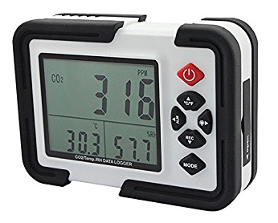

# .NET Library for HT2000 USB CO2 Logger

This is a .NET library, written in C#, for the HT2000 USB CO2 logger. This USB CO2 data logger is sold under many names by many different sellers. It looks like this:



The logger contains an NDIR CO2 sensor (i.e. one that can actually sense CO2, not "eCO2" with a metal oxide sensor) and a temperature and humidity sensor. It is capable of logging these sensor readings to internal flash memory storage at a configurable rate, and the historical data can be downloaded over USB.

The OEM provides Windows software to interface with the device. The device presents itself as a USB HID endpoint with a VID/PID of 0x10C4 / 0x82CD. I reverse engineered the HID data format and protocol by hooking the interface application at runtime and monitoring its API calls.

I wrote this library a while back and have not worked on it since. It's a bit of a mess but as far as I'm aware it constitutes the most complete reverse engineering attempt on this device so far.

## How do I use it?

Take a look at the HT2000LibTest project. That'll give you a high level overview.

There are three HT2000 manager classes from three different attempts at writing an interface: `HT2000ManagerDevNet`, `HT2000ManagerLibUsb`, and `HT2000ManagerNative`. At current only the last one (native) works - I found that the device would not respond to HID reports from [Device.NET](https://github.com/MelbourneDeveloper/Device.Net) nor LibUsb. A theory on why this problem occurs is presented below.

The native implementation is, for obvious reasons, specific to Windows. However, you could certainly port this to Linux or BSD or MacOS or whatever else you might like with little difficulty.

The two main APIs are:

- `GetState()`, which returns the current state of the sensors, device config, and status registers.
- `DumpData()`, which dumps the logged data.

## Prior art

I found a number of libraries and articles online that were useful:

- https://github.com/tomvanbraeckel/slab_ht2000
- https://globalblindspot.blogspot.com/2016/08/reverse-engineering-slab-ht2000-co2_11.html
- https://github.com/eschava/HT2000-java
- https://github.com/temper8/HT2000Viewer

However, I found that none of them _quite_ had the details figured out, with some of the reports being incorrectly documented. As far as I know, nobody else has ever reverse engineered the historical data dumping interface. Nevertheless, the existing libraries saved me a fair bit of effort in figuring out the basics.

## Interface Description

The device exposes a fairly simple USB HID interface. It does have some oddities, though. I found that in order to communicate with it reliably, it was _mandatory_ to use [overlapped IO](https://en.wikipedia.org/wiki/Overlapped_I/O). Using synchronous IO caused no response to be returned on HID reports, which is likely why the Device.NET and LibUsb approaches didn't work. I'm not sure if this is a Windows-specific issue or device-specific.

### Status Report

Status information is 61 bytes long and is present in HID input report 5. It has the following structure:

| Offset (Bytes) | Type / Size | Name                | Info                                                       |
| -------------- | ----------- | ------------------- | ---------------------------------------------------------- |
| 0              | byte        | Report ID           | Set to 5, echoing the requested report number              |
| 1              | uint32      | Timestamp           | Unix epoch timestamp                                       |
| 5              | uint16      | Total Records       | The total number of stored records in the log              |
| 7              | uint16      | Temperature         | Current temperature                                        |
| 9              | uint16      | Humidity            | Current humidity. To convert to RH%, divide by 10          |
| 11             | uint16      | Temp Alarm Low      | Temperature at which the low temperature alarm will sound  |
| 13             | uint16      | Temp Alarm High     | Temperature at which the high temperature alarm will sound |
| 15             | uint16      | Humidity Alarm Low  | Humidity at which the low humidity alarm will sound        |
| 17             | uint16      | Humidity Alarm High | Humidity at which the high humidity alarm will sound       |
| 19             | 3 bytes     | Unknown             |                                                            |
| 22             | uint16      | CO2 Alarm High      | CO2 count (ppm) at which the high CO2 alarm will sound     |
| 24             | uint16      | CO2 Level           | CO2 count (ppm)                                            |
| 26             | uint16      | CO2 Alarm Low       | CO2 count (ppm) at which the low CO2 alarm will sound      |

All numeric values are in big endian.

Temperature and humidity values are reported as fixed-point integers. To convert the reported temperature values to &deg;C, subtract 400 and divide by 10. To convert the reported humidity values to RH%, divide by 10.

The returned buffer size may be as low as 32 bytes, but I found that I had to send a 61 byte buffer as part of the HID input report request to get the device to respond.

I have not found out how to read the logging configuration, e.g. how frequently the log is written to.

### Log Report

The historical log can be read from HID input report 8. The log page to read must be first set by writing to the device. The procedure is as follows:

1. Write a 61 byte buffer directly to the device handle, with the first byte set to 4 and the following two bytes to a 16-bit big-endian value representing the index of the log page you want to read.
2. Wait for overlapped I/O to complete.
3. Request HID input report 8, using a 61 byte buffer.
4. The first byte will contain 8, matching the HID input report number. This will be followed by up to 12 log entries, totalling 60 bytes. The structure of each log entry is described below.
5. If you find a log entry that is just `FF FF FF FF FF`, you've hit the end of the log and can stop.
6. Increment the log page index and repeat from step 1.

The log is a simple array of 12 entries. Each element in the data log is five bytes long, with fields assembled from its constituent nibbles. Temperature and humidity values are 3 nibbles (12 bits) each, and the CO2 value is 4 nibbles (32 bits).

Labelling the nibbles of the 5 bytes:

```
ab cd ef gh ij
```

The temperature value is `fcd`. The humidity value is `eab`. The CO2 value is `ijgh`. In pseudocode:

```csharp
temp = ((log[2] & 0xF) << 8) + log[1];
hum = ((log[2] & 0xF0) << 4) + log[0];
co2 = ((log[4] << 8) << 8) + log[3];
```

The temperature and humidity values are scaled in the same way as in the status report. The CO2 value is in PPM.

The time of each log entry is calculated based on the configured logging timestep and the timestamp from the status report. I do not currently know how to retrieve the configured logging timestep from the device.

## License

Released under [MIT license](LICENSE.txt).